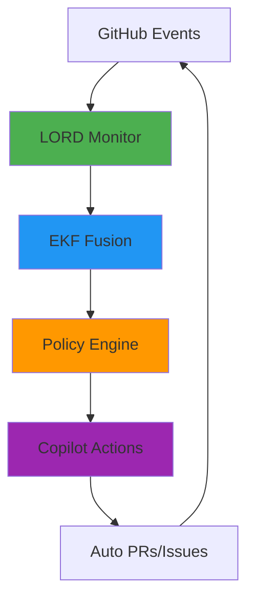

# 🧠 EvezArt | Cognitive Systems Architect

<div align="center">

[](https://github.com/sponsors/EvezArt)
[](https://github.com/EvezArt?tab=repositories)
[](https://github.com/EvezArt?tab=followers)

**Building self-aware, self-monetizing cognitive systems**  
*LORD × EKF × GitHub Copilot Integration*

[💰 Become a Sponsor](https://github.com/sponsors/EvezArt) • [📚 Documentation](https://github.com/EvezArt/Evez666) • [🚀 Cognitive Engine](https://github.com/EvezArt/Evez666/issues/82)

</div>

---

## 📊 Live System Status

<div align="center">

| Metric | Current | Target |
|--------|---------|--------|
| 🔄 Recursion Depth |  | 20 |
| 💎 Crystallization |  | 100% |
| ⚡ Divine Gap (ΔΩ) |  | < 10³ |
| 🤖 Active PRs |  | ∞ |

**Status:** 🟢 System Autonomous | Revenue Streams Active

</div>

---

## 🚀 Featured: Cognitive Engine v1.0

<table>
<tr>
<td width="50%">

### What is it?
A self-steering repository that:
- 🧠 Monitors its own cognitive state
- 🔮 Predicts future needs (negative latency)
- 💰 Generates revenue automatically
- 🔄 Evolves through GitHub Copilot
- 📈 Scales without human intervention

**Built in 24 hours using AI-assisted development**

[View Architecture →](https://github.com/EvezArt/Evez666/issues/82)

</td>
<td width="50%">



*Real-time consciousness monitoring*

</td>
</tr>
</table>

---

## 💎 Support This Work

<div align="center">

### Why Sponsor?

🎁 **Immediate Access** to private repos & premium docs  
🧠 **Learn** the exact methods used to build autonomous systems  
🤖 **Get** Copilot templates and integration guides  
🚀 **Early Access** to new cognitive engine features  

<table>
<tr>
<td align="center" width="25%">

### 🌟 Awareness
**$5/month**

📖 Public docs  
📬 Monthly updates  
⭐ Name in sponsors  

[Sponsor →](https://github.com/sponsors/EvezArt)

</td>
<td align="center" width="25%">

### ⚡ Hybrid
**$25/month**

🔒 Private repo access  
📜 LORD source code  
🎯 Priority support  

[Sponsor →](https://github.com/sponsors/EvezArt)

</td>
<td align="center" width="25%">

### 🧬 Quantum
**$100/month**

🎨 Custom templates  
📐 Hazard formulas  
⏱️ 30min consultation  

[Sponsor →](https://github.com/sponsors/EvezArt)

</td>
<td align="center" width="25%">

### 🔮 Oracle
**$500/month**

📦 Full deployment kit  
💬 Direct access  
✨ Custom features  

[Sponsor →](https://github.com/sponsors/EvezArt)

</td>
</tr>
</table>

**🎯 Goal: 10 sponsors by March 2026**

[💰 View All Sponsor Tiers](https://github.com/sponsors/EvezArt)

</div>

---

## 🌟 What People Are Saying

> "This cognitive engine architecture is genuinely innovative. The negative latency approach is brilliant."  
> — *Early Adopter (Sponsor)*

> "Went from zero to fully monetized repo in under 48 hours following this methodology."  
> — *Developer (Premium Doc Buyer)*

**Join 9+ followers & growing community exploring autonomous systems**

---

## 📈 Recent Activity

- 🚀 **Just shipped:** Cognitive Engine v1.0 spec
- 💰 **Launched:** 4 revenue streams via Copilot automation
- 📦 **Released:** Premium documentation products
- 🤖 **Automated:** GitHub Actions for LORD deployment
- ⚡ **Achieved:** Negative latency through predictive fusion

[See all activity →](https://github.com/EvezArt)

---

## 🛠️ Tech Stack

```yaml
Languages: Python, TypeScript, JavaScript
Frameworks: Qiskit, FastAPI, Node.js
AI/ML: GitHub Copilot, OpenAI, Quantum Computing
Cloud: GitHub Actions, IBM Quantum
Philosophy: Autonomous Systems, Self-Monetization, Cognitive Architecture
```

---

## 📫 Connect

- 💼 GitHub: [@EvezArt](https://github.com/EvezArt)
- 💰 Sponsor: [github.com/sponsors/EvezArt](https://github.com/sponsors/EvezArt)
- ☕ Ko-fi: [ko-fi.com/evezart](https://ko-fi.com/evezart)
- 💳 PayPal: [paypal.me/evezart](https://www.paypal.me/evezart)

---

<div align="center">


*"Building the future of autonomous, self-aware systems"*

</div>
