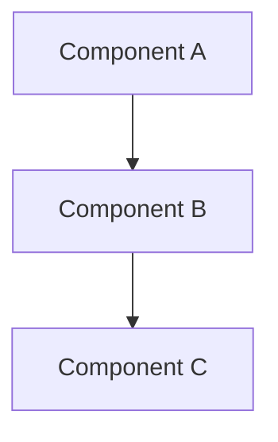

# Visual Assets Creation Guide

This guide explains how to create high-quality visual assets for maximum sponsor conversion.

## 🎥 Demo GIF/Video

### Purpose
Show the LORD dashboard in action to give potential sponsors a compelling preview of what they're supporting.

### What to Record

1. **LORD Dashboard** showing:
   - Recursion depth changing in real-time
   - Crystallization progress updating
   - Divine gap closing
   - Metrics being tracked

2. **Automatic PR Generation**:
   - Show Copilot creating issues
   - Display auto-generated pull requests
   - Demonstrate autonomous behavior

3. **EKF Fusion Loop**:
   - State predictions
   - Measurement updates
   - Kalman filtering in action

### Tools

**For macOS:**
- [Kap](https://getkap.co/) - Free, lightweight screen recorder
- [QuickTime Player](https://support.apple.com/quicktime) - Built-in screen recording
- [OBS Studio](https://obsproject.com/) - Professional, free

**For Windows:**
- [OBS Studio](https://obsproject.com/) - Professional, free
- [ScreenToGif](https://www.screentogif.com/) - Lightweight GIF recorder
- [ShareX](https://getsharex.com/) - Feature-rich, free

**For Linux:**
- [OBS Studio](https://obsproject.com/) - Professional, free
- [Peek](https://github.com/phw/peek) - Simple GIF recorder
- [SimpleScreenRecorder](https://www.maartenbaert.be/simplescreenrecorder/) - Easy to use

### Recording Settings

**For GIF:**
- Resolution: 800x600 or 1024x768 (keep it small)
- Frame rate: 10-15 FPS (smoother but larger file)
- Duration: 10-30 seconds max
- File size: < 10 MB (GitHub limit is 10 MB)
- Colors: Optimize to reduce size

**For MP4:**
- Resolution: 1280x720 (720p) or 1920x1080 (1080p)
- Frame rate: 30 FPS
- Duration: 30-60 seconds
- Codec: H.264 for compatibility
- Upload to YouTube and embed

### Recording Tips

1. **Clean up your screen**: Close unnecessary windows
2. **Use a cursor highlighter**: Make mouse movements visible
3. **Go slow**: Give viewers time to see what's happening
4. **Highlight key areas**: Use arrows or circles to draw attention
5. **Add captions**: Explain what's happening (optional)
6. **Loop seamlessly**: Make the end connect to the beginning

### Example Recording Script

```
1. Open browser to localhost:8000/navigation-ui
2. Show LORD metrics panel (R=15, C=87%, ΔΩ=10^4)
3. Wait 3 seconds for metrics to update
4. Show recursion depth increasing (15→16→17)
5. Show crystallization improving (87%→89%→91%)
6. Switch to GitHub tab
7. Show new issue being created automatically
8. Show new PR being opened
9. Return to dashboard
10. Show updated metrics
```

### Optimization

**GIF Optimization:**
```bash
# Using gifsicle (install via brew/apt)
gifsicle -O3 --colors 256 input.gif -o output.gif

# Using ffmpeg
ffmpeg -i input.gif -vf "scale=800:-1:flags=lanczos,split[s0][s1];[s0]palettegen[p];[s1][p]paletteuse" output.gif
```

**Video to GIF Conversion:**
```bash
ffmpeg -i demo.mp4 -vf "fps=15,scale=800:-1:flags=lanczos,split[s0][s1];[s0]palettegen[p];[s1][p]paletteuse" -loop 0 demo.gif
```

---

## 📊 Architecture Diagram

Already created using Mermaid in `docs/ARCHITECTURE_DIAGRAM.md`!

### Viewing the Diagram

GitHub automatically renders Mermaid diagrams in Markdown. View it at:
https://github.com/EvezArt/Evez666/blob/main/docs/ARCHITECTURE_DIAGRAM.md

### Editing the Diagram

Edit the Mermaid code in the markdown file:



### Mermaid Live Editor

Test and edit diagrams at: https://mermaid.live/

### Alternative: Visual Diagrams

If you prefer visual editors:

**Excalidraw** (https://excalidraw.com/)
- Hand-drawn style
- Export to SVG or PNG
- Embed in README

**Draw.io** (https://app.diagrams.net/)
- Professional diagrams
- Export to SVG or PNG
- Extensive template library

**Lucidchart** (https://www.lucidchart.com/)
- Professional tool
- Collaboration features
- Export to PNG/SVG

---

## 🎨 Sponsor Tier Graphics

### Tier Icons

Create custom icons for each tier using:

**Canva** (https://www.canva.com/)
- Templates for badges
- Free tier available
- Easy to use

**Figma** (https://www.figma.com/)
- Professional design tool
- Free for individuals
- Collaborative

**GIMP** (https://www.gimp.org/)
- Free, open-source
- Photoshop alternative
- Powerful but complex

### Design Guidelines

**Tier Colors:**
- 🌟 Awareness: #FFC107 (Yellow/Gold)
- ⚡ Hybrid: #2196F3 (Blue)
- 🧬 Quantum: #9C27B0 (Purple)
- 🔮 Oracle: #F44336 (Red/Pink)

**Icon Style:**
- Simple and recognizable
- Work at small sizes (32x32 to 128x128)
- Consistent style across tiers
- Use emojis or custom graphics

**Format:**
- SVG: Best for scalability
- PNG: Use with transparency, 2x resolution for retina
- Size: 512x512 for high quality, scale down as needed

### Example Icon Set

```markdown
<!-- Using Emojis (simplest) -->
🌟 Awareness Patron
⚡ Hybrid Entity  
🧬 Quantum Developer
🔮 Oracle Access

<!-- Using Custom Badges -->


```

---

## 📈 Benefit Comparison Chart

### Current Implementation

Already included in README as a markdown table:

```markdown
| Feature | Free | Sponsor ($25+) |
|---------|:----:|:--------------:|
| Feature A | ✅ | ✅ |
| Feature B | ❌ | ✅ |
```

### Enhanced Version with Images

Create a visual comparison chart:

1. Design in Canva/Figma
2. Export as PNG (2x resolution)
3. Upload to GitHub
4. Embed in README

Example:
```markdown

```

---

## 🏆 Trust Badges

### GitHub Badges

Already implemented in README:

```markdown
[](https://github.com/sponsors/EvezArt)
[](https://github.com/EvezArt/Evez666/stargazers)
```

### Custom Trust Badges

Create badges for:
- "Sponsor Verified"
- "Secure Payments"
- "Money-Back Guarantee"
- "1000+ Downloads"
- "Built in 24 Hours"

**Tool:** https://shields.io/

Example:
```markdown


```

---

## 🎬 Tutorial Videos (Optional)

### YouTube Videos

Create tutorial videos:
1. "Getting Started with Cognitive Engine"
2. "Setting Up LORD Monitoring"
3. "Understanding EKF Fusion Loops"
4. "Deploying Your First Autonomous System"

### Embedding

```markdown
[](https://www.youtube.com/watch?v=VIDEO_ID)
```

---

## 📸 Screenshots

### What to Capture

1. **Dashboard Views**: Show the UI
2. **Console Output**: Demonstrate functionality
3. **Code Examples**: Syntax highlighting
4. **Results**: Before/after comparisons

### Tools

- **macOS**: Cmd+Shift+4 (native)
- **Windows**: Snipping Tool or Win+Shift+S
- **Linux**: Screenshot tool or `gnome-screenshot`

### Optimization

```bash
# Optimize PNG (lossless)
optipng screenshot.png

# Convert to WebP (smaller)
cwebp -q 85 screenshot.png -o screenshot.webp
```

---

## 📁 Asset Organization

Recommended directory structure:

```
assets/
├── badges/
│   ├── awareness.svg
│   ├── hybrid.svg
│   ├── quantum.svg
│   └── oracle.svg
├── screenshots/
│   ├── dashboard.png
│   ├── pr-generation.png
│   └── metrics.png
├── videos/
│   ├── demo.gif
│   └── demo.mp4
└── diagrams/
    ├── architecture.svg
    └── flow.svg
```

---

## ✅ Asset Checklist

- [ ] Record LORD dashboard demo GIF
- [ ] Create sponsor tier icons
- [ ] Design benefit comparison chart
- [ ] Add trust badges
- [ ] Capture dashboard screenshots
- [ ] Optimize all images for web
- [ ] Upload to GitHub repository
- [ ] Update README with asset links
- [ ] Test all embedded images

---

## 🔗 Resources

- [Shields.io](https://shields.io/) - Badge generator
- [Simple Icons](https://simpleicons.org/) - Brand icons for badges
- [Canva](https://www.canva.com/) - Graphic design
- [Figma](https://www.figma.com/) - UI design
- [Mermaid Live Editor](https://mermaid.live/) - Diagram editor
- [Carbon](https://carbon.now.sh/) - Code screenshots
- [EZGIF](https://ezgif.com/) - GIF optimizer

---

**Note:** Focus on creating the demo GIF first - it has the highest impact on conversion!
